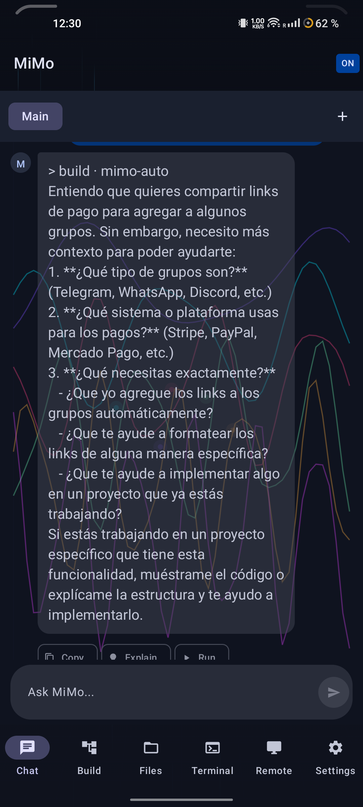
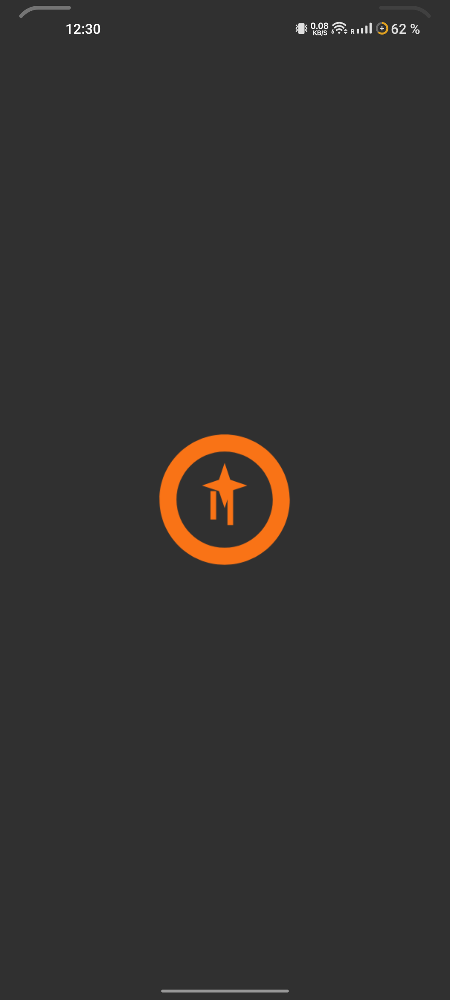

# MiMo Mobile

**Controla tu PC desde el celular. Asistente AI siempre disponible.**

[](https://link.mercadopago.com.mx/mimomobile)
[](https://link.mercadopago.com.mx/mimomobile)

---

## Capturas de pantalla

| Chat | Build | Settings |
|------|-------|----------|
|  |  |  |

---

## Que es MiMo Mobile

App Android nativa que convierte tu teléfono en un centro de control remoto para tu PC. Conecta vía WebSocket con un servidor Python ligero que ejecuta comandos, gestiona archivos y controla el escritorio — todo sin dependencias externas.

### Para quién es
- **Desarrolladores** que quieren controlar su PC desde el celular
- **Administradores de sistemas** que necesitan acceso remoto ligero
- **Usuarios avanzados** que quieren su asistente AI siempre disponible

---

## Funcionalidades principales

| Feature | Descripción |
|---------|-------------|
| **Chat AI** | Streaming en tiempo real, sin latencia perceptible |
| **Remote Desktop** | Captura de pantalla + control de mouse/teclado |
| **File Manager** | Leer, editar, crear y eliminar archivos remotamente |
| **Terminal** | Ejecutar comandos shell con output en vivo |
| **Build Monitor** | Visualización animada del progreso de compilación |
| **Device Manager** | Control de dispositivos Android vía ADB |

---

## Modelo de negocio

| Tier | Precio | Incluye |
|------|--------|---------|
| **Free** | $0 | 1 dispositivo, chat básico, 50 mensajes/día |
| **Pro** | $9.99/mes | 5 dispositivos, remote desktop, file manager, sin límites |
| **Team** | $29.99/mes | Dispositivos ilimitados, prioridad de soporte, actualizaciones beta |

---

## Arquitectura técnica

```
┌─────────────────────────────────────────┐
│         MiMo Mobile (Android)           │
│   Kotlin + Jetpack Compose + Material3  │
│   WebSocket raw TCP (sin OkHttp)        │
└──────────────────┬──────────────────────┘
                   │ WebSocket (8765)
┌──────────────────▼──────────────────────┐
│         MiMo Server (Python)            │
│   asyncio.Protocol, stdlib solamente    │
│   Zero dependencies                     │
└──────────────────┬──────────────────────┘
                   │ Subprocess
┌──────────────────▼──────────────────────┐
│         MiMo Code CLI                   │
│   Asistente AI local                    │
└─────────────────────────────────────────┘
```

### Stack técnico

| Componente | Tecnología | Version |
|------------|------------|---------|
| Lenguaje | Kotlin | 2.2.10 |
| UI Framework | Jetpack Compose | BOM 2026.02.01 |
| Design System | Material3 | Dynamic Colors |
| Arquitectura | MVVM | AndroidViewModel |
| WebSocket | Raw TCP | Custom impl |
| Persistencia | DataStore | Preferences |
| Server | Python | 3.13+ |
| Protocolo | asyncio.Protocol | stdlib |

---

## Instalación rápida

### Server (tu PC)
```bash
git clone https://github.com/dixi3stdgdl-design/mimo-mobile-server.git
cd mimo-mobile-server
chmod +x install.sh
./install.sh
```

### App (tu celular)
1. Descarga el APK desde [Releases](https://github.com/dixi3stdgdl-design/mimomobile/releases)
2. Instala en tu dispositivo Android
3. Abre la app e ingresa la IP de tu PC
4. PIN por defecto: `MIMO2026`

---

## Configuración del server

Crea un archivo `.env`:
```bash
MIMO_CMD=~/.mimocode/bin/mimo
MIMO_AUTH_PIN=MIMO2026
MIMO_WORKSPACE=~
MIMO_WS_PORT=8765
MIMO_HTTP_PORT=8080
```

---

## Rendimiento

| Métrica | Valor |
|---------|-------|
| Latencia de conexión | ~300ms |
| Tiempo de respuesta chat | 1-3s |
| FPS remote desktop | ~1 |
| Tamaño APK | ~19MB |
| RAM promedio | ~45MB |

---

## Requisitos

- Android 8.0+ (API 26)
- Python 3.10+ (en el PC)
- MiMo Code CLI instalado

---

## Seguridad

- Autenticación por PIN
- WebSocket sobre red local
- Sin exposición a internet (a menos que se configure)
- Sin dependencias de servicios externos

---

## Solución de problemas

### Errores de compilación

```bash
# Limpiar build
./gradlew clean

# Rebuild completo
./gradlew assembleDebug --no-daemon

# Si falla por memoria
./gradlew assembleDebug -Dorg.gradle.jvmargs="-Xmx4g"

# Si falla por Kotlin daemon
./gradlew --stop
./gradlew assembleDebug

# Forzar re-descarga de dependencias
rm -rf ~/.gradle/caches/
./gradlew assembleDebug

# Verificar Java
java -version
echo $JAVA_HOME

# Compilar con Java específica
JAVA_HOME=/home/DexTer/android-studio/jbr ./gradlew assembleDebug
```

### Errores de instalación

```bash
# Instalar APK manualmente
adb install -r -d app/build/outputs/apk/debug/app-debug.apk

# Si falla, push directo
adb push app/build/outputs/apk/debug/app-debug.apk /data/local/tmp/
adb shell pm install -r -d /data/local/tmp/app-debug.apk

# Desinstalar primero
adb uninstall com.mimo.mobile.debug
adb install app/build/outputs/apk/debug/app-debug.apk
```

### Errores de conexión

```bash
# Verificar que el server está corriendo
curl http://localhost:8080/health

# Verificar puertos
netstat -tlnp | grep 8765
netstat -tlnp | grep 8080

# Matar proceso del server
pkill -f server.py

# Reiniciar server
cd mimo-mobile-server
python3 server.py

# Verificar WebSocket
wscat -c ws://localhost:8765
```

### Errores de ADB WiFi

```bash
# Verificar dispositivos
adb devices

# Conectar por WiFi
adb connect 192.168.100.166:5555

# Activar TCP/IP
adb tcpip 5555

# Verificar IP del celular
adb shell ip addr show wlan0

# ADB reverse para WebSocket
adb reverse tcp:8765 tcp:8765
adb reverse tcp:8080 tcp:8080

# Reconectar si se pierde
adb disconnect
adb connect 192.168.100.166:5555
```

### Logs y debugging

```bash
# Ver logs del server
tail -f /tmp/mimo-server.log

# Ver logs de Android
adb logcat | grep -i mimo

# Ver errores de Compose
adb logcat | grep -i "AnimationVector\|IllegalState"

# Verificar memoria
adb shell dumpsys meminfo com.mimo.mobile.debug

# Forzar cierre
adb shell am force-stop com.mimo.mobile.debug
```

---

## Roadmap

- [ ] Soporte multi-idioma (EN/ES)
- [ ] Widget de pantalla de inicio
- [ ] Notificaciones push
- [ ] Soporte Bluetooth
- [ ] Modo offline
- [ ] Integración con更多 AI providers

---

## Licencia

MIT License - Ver [LICENSE](LICENSE)

---

## Contacto

[@dixi3stdgdl-design](https://github.com/dixi3stdgdl-design)
